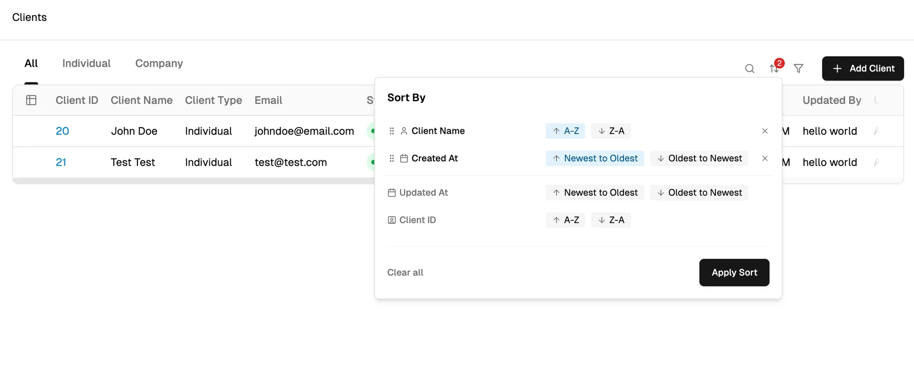

# 🧠 Task Overview

### **Objective**

Build a **Client List Table UI** that supports **multi-sort with drag-and-drop** sorting priority — just like you see in the reference below.

This task tests:

- your grasp of React fundamentals,
- component structure and state handling,
- and how well you can mimic real-world UI functionality.

### **Reference UI**

📸 See the reference screenshot attached here

(mock data is fine — no need to build forms to add it)

# 🛠️ Tech Stack

Use the following stack:

- Next.js App Router
- Tailwind CSS for styling
- TypeScript is mandatory
- You may use libraries like:
  - **@dnd-kit** or **react-beautiful-dnd** (for drag-and-drop)
  - **shadcn/ui** (for UI components)

# ✅ Core Requirements

- A table view with mock data of clients (e.g., name, email, created at, updated at, status).
- A Sort Panel (like in the screenshot) where:
  - Users can add multiple sort criteria (e.g., sort by Name, Created At).
  - Each sort criterion should support ascending/descending toggle.
  - Sort criteria can be dragged up/down to prioritize their order.
- Table data should update based on the combined sort logic.

# ✨ Bonus (Optional but impressive)

- Persist the sort order in **localStorage** using zustand.
- Add subtle animations while sorting.
- Clean visual design using **shadcn/ui** or your own component system.

# 🧪 Evaluation Criteria

- Code quality & reusability
- Component structure & state handling
- Sorting logic and interaction UX
- Attention to detail in replicating the UI
- Optional touches (animation, state persistence)